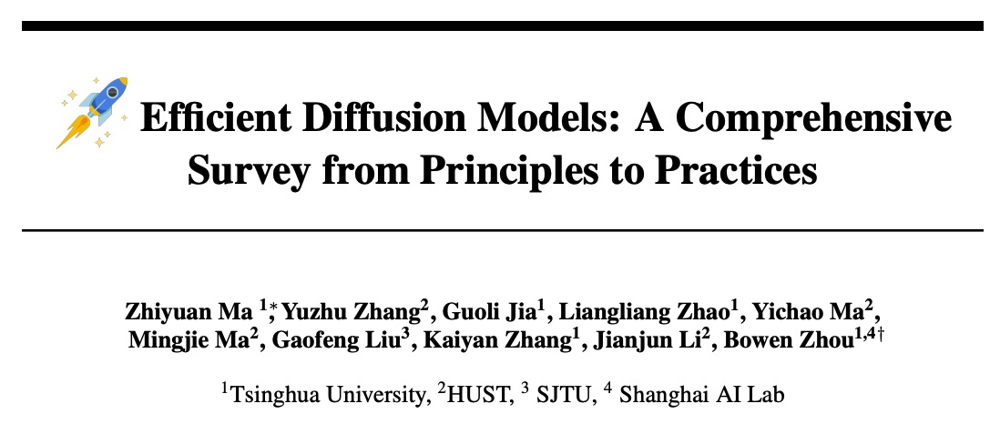
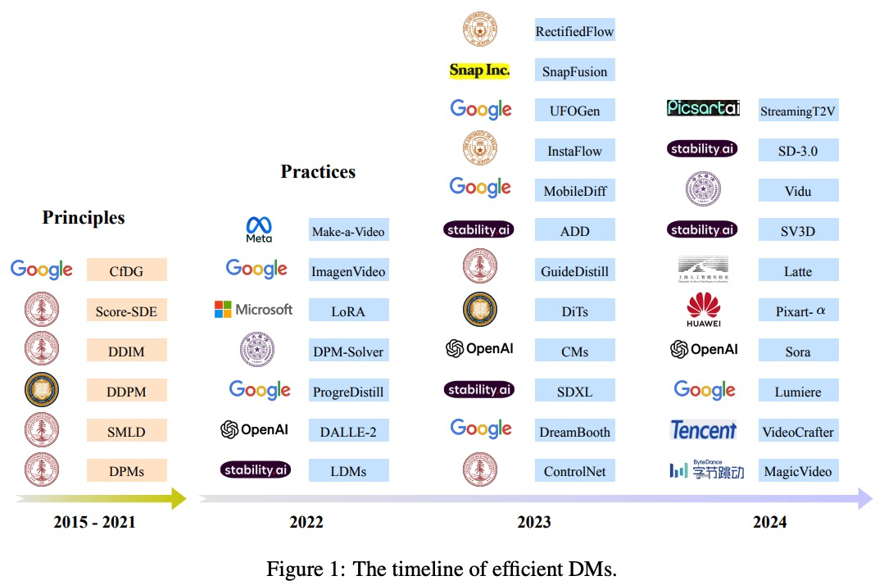
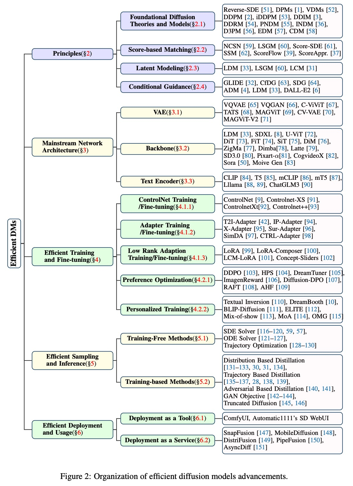
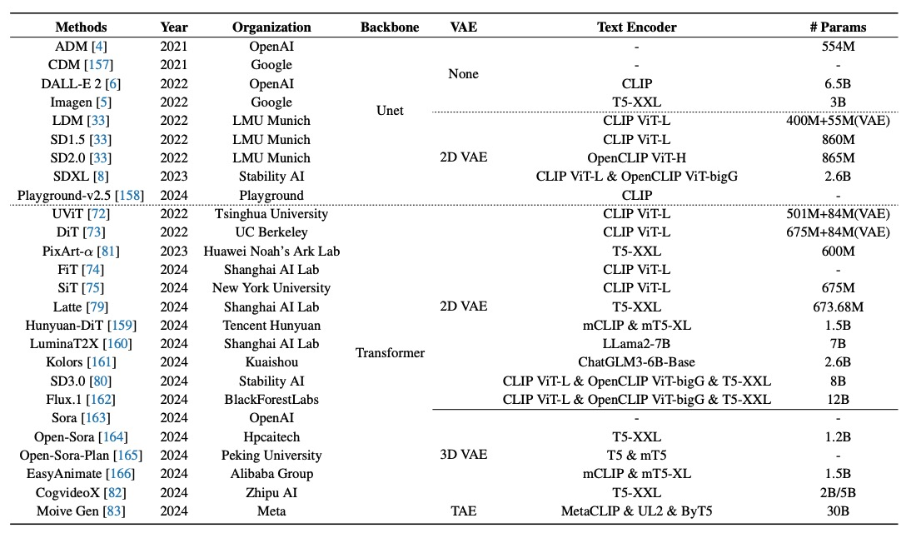
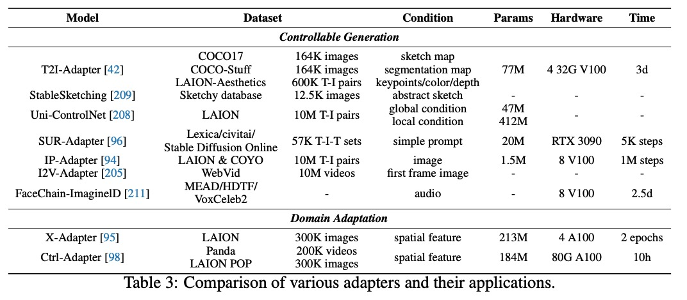

# Efficient-Diffusion-Models

[](https://arxiv.org/abs/2410.11795) 
[](https://github.com/ponyzym/Efficient-Diffusion-Models-Survey.git)
[](https://github.com/ponyzym/Efficient-Diffusion-Models-Survey)
[]()

<!-- omit in toc -->
## 📢 Updates

- **2025.03**: We released a survey paper "[Efficient Diffusion Models: A Comprehensive
Survey from Principles to Practices](https://arxiv.org/abs/2410.11795)". Feel free to cite or open pull requests.

<!-- omit in toc -->
## 👀 Introduction

Welcome to the repository for our survey paper, "Efficient Diffusion Models: A Comprehensive
Survey from Principles to Practices". This repository provides resources and updates related to our research. For a detailed introduction, please refer to [our survey paper](https://arxiv.org/abs/2410.11795).


The recent timeline of efficient DMs, covering core methods and the release of open-source and closed-source reproduction projects.


This figure outlines the conceptual framework employed in our presentation of efficient diffusion models.


This figure compares the core features of mainstream diffusion-based generative models


This figure outline various adapters and their applications.
<!-- omit in toc -->
## 📒 Table of Contents

- [Efficient-Diffusion-Models](#Efficient-Diffusion-Models)
  - [Part 1: Introduction](#part-1-introduction)
  - [Part 2: Efficient Diffusion Models: Foundational Principles](#part-2-efficient-diffusion-models-foundational-principles)
  - [Part 3: Mainstream Network Architectures](#part-3-mainstream-network-architectures)
  - [Part 4: Efficient Training and Fine-Tuning](#part-4-efficient-training-and-fine-tuning)
  - [Part 5: Efficient Sampling and Inference](#part-5-efficient-sampling-and-inference)
  - [Part 6: Efficient Deployment And Usage](#part-6-efficient-deployment-and-usage)
  - [Part 7: Discussion and Conclusion](#part-7-discussion-and-conclusion)

## Part 1: Introduction
* Improving image generation with better captions [[Paper]](https://cdn.openai.com/papers/dall-e-3.pdf) 
* Plug-and-play diffusion features for text-driven image-to-image translation [[Paper]](https://openaccess.thecvf.com/content/CVPR2023/html/Tumanyan_Plug-and-Play_Diffusion_Features_for_Text-Driven_Image-to-Image_Translation_CVPR_2023_paper.html) 
* Training-Free Structured Diffusion Guidance for Compositional Text-to-Image Synthesis [[Paper]](https://arxiv.org/abs/2212.05032) 
* Sine: Single image editing with text-to-image diffusion models [[Paper]](https://openaccess.thecvf.com/content/CVPR2023/html/Zhang_SINE_SINgle_Image_Editing_With_Text-to-Image_Diffusion_Models_CVPR_2023_paper.html) 
* Instructpix2pix: Learning to follow image editing instructions[[Paper]](https://openaccess.thecvf.com/content/CVPR2023/html/Brooks_InstructPix2Pix_Learning_To_Follow_Image_Editing_Instructions_CVPR_2023_paper.html) 
* Latent video diffusion models for high-fidelity video generation with arbitrary lengths [[Paper]](https://ojs.aaai.org/index.php/AAAI/article/view/28226) 
* MagicVideo: Efficient Video Generation With Latent Diffusion Models [[Paper]](https://arxiv.org/abs/2211.11018) 
* ModelScope Text-to-Video Technical Report [[Paper]](https://arxiv.org/abs/2308.06571) 
* Stable video diffusion: Scaling latent video diffusion models to large
datasets [[Paper]](https://arxiv.org/abs/2311.15127) 
* VideoCrafter1: Open Diffusion Models for High-Quality Video Generation [[Paper]](https://arxiv.org/abs/2310.19512) 
* VideoCrafter2: Overcoming Data Limitations for High-Quality Video Diffusion Models [[Paper]](hhttps://arxiv.org/abs/2401.09047) 
* StableVideo: Text-driven Consistency-aware Diffusion Video Editing [[Paper]](https://openaccess.thecvf.com/content/ICCV2023/html/Chai_StableVideo_Text-driven_Consistency-aware_Diffusion_Video_Editing_ICCV_2023_paper.html) 
* MagicVideo-V2: Multi-Stage High-Aesthetic Video Generation [[Paper]](https://arxiv.org/abs/2401.04468) 
* Lumiere: A Space-Time Diffusion Model for Video Generation [[Paper]](https://arxiv.org/abs/2401.12945) 
* Text2video-zero: Text-to-image diffusion models are zero-shot video generators [[Paper]](https://openaccess.thecvf.com/content/ICCV2023/html/Khachatryan_Text2Video-Zero_Text-to-Image_Diffusion_Models_are_Zero-Shot_Video_Generators_ICCV_2023_paper.html) 
* FLATTEN: optical FLow-guided ATTENtion for consistent text-to-video editing [[Paper]](https://arxiv.org/abs/2310.05922) 
* Dreamix: Video Diffusion Models are General Video Editors
 [[Paper]](https://arxiv.org/abs/2302.01329) 
* ControlVideo: Training-free Controllable Text-to-Video Generation [[Paper]](https://arxiv.org/abs/2305.13077) 
* Rerender a video: Zero-shot text-guided video-to-video translation [[Paper]](https://dl.acm.org/doi/abs/10.1145/3610548.3618160) 
* Dreamfusion: Text-to-3d using 2d diffusion [[Paper]](https://arxiv.org/abs/2209.14988) 
* Mvdream: Multi-view diffusion for 3d generation [[Paper]](https://arxiv.org/abs/2308.16512) 
* Magic3D: High-Resolution Text-to-3D Content Creation [[Paper]](https://openaccess.thecvf.com/content/CVPR2023/html/Lin_Magic3D_High-Resolution_Text-to-3D_Content_Creation_CVPR_2023_paper.html) 
* Hifa: High-fidelity text-to-3d with advanced diffusion guidance [[Paper]](https://export.arxiv.org/abs/2305.18766v2) 
* SV3D: Novel Multi-view Synthesis and 3D Generation from a Single Image using Latent Video Diffusion [[Paper]](https://arxiv.org/abs/2403.12008) 
* DDM2: Self-Supervised Diffusion MRI Denoising with Generative Diffusion Models [[Paper]](https://arxiv.org/abs/2302.03018) 
* Solving Inverse Problems in Medical Imaging with Score-Based Generative Models [[Paper]](https://arxiv.org/abs/2111.08005) 
* Diffwave: A versatile diffusion model for audio synthesis[[Paper]] (https://arxiv.org/abs/2009.09761) 
* Make-An-Audio: Text-To-Audio Generation with Prompt-Enhanced Diffusion Models [[Paper]](https://proceedings.mlr.press/v202/huang23i.html) 
* Diffsound: Discrete Diffusion Model for Text-to-Sound Generation [[Paper]](https://ieeexplore.ieee.org/abstract/document/10112585) 
* Highly accurate protein structure prediction with AlphaFold [[Paper]](https://www.nature.com/articles/s41586-021-03819-2) 
* Denovo design of protein structure and function with rfdiffusion [[Paper]](https://www.nature.com/articles/s41586-023-06415-8) 
* Antigen-specific antibody design and optimization with diffusion-based
generative models for protein structures [[Paper]](https://proceedings.neurips.cc/paper_files/paper/2022/hash/3fa7d76a0dc1179f1e98d1bc62403756-Abstract-Conference.html) 
* A dual diffusion model enables
3d molecule generation and lead optimization based on target
pockets [[Paper]](https://www.nature.com/articles/s41467-024-46569-1) 
* Diffdock: Diffusion steps, twists, and turns for molecular docking [[Paper]](https://arxiv.org/abs/2210.01776) 
* Fast sampling of diffusion models via operator learning [[Paper]](https://proceedings.mlr.press/v202/zheng23d.html) 
* Progressive distillation for fast sampling
of diffusion models [[Paper]](https://arxiv.org/abs/2202.00512) 
* Consistency Models [[Paper]](https://openreview.net/forum?id=FmqFfMTNnv) 
* Latent Consistency Models: Synthesizing High-Resolution Images with Few-Step Inference [[Paper]](https://arxiv.org/abs/2310.04378) 
* GLIDE: Towards Photorealistic Image Generation and Editing with Text-Guided Diffusion Models [[Paper]](https://arxiv.org/abs/2112.10741) 
* High-Resolution Image Synthesis With Latent Diffusion Models [[Paper]](https://openaccess.thecvf.com/content/CVPR2022/html/Rombach_High-Resolution_Image_Synthesis_With_Latent_Diffusion_Models_CVPR_2022_paper) 
* Structure and content-guided video synthesis with diffusion
models [[Paper]](https://openaccess.thecvf.com/content/ICCV2023/html/Esser_Structure_and_Content-Guided_Video_Synthesis_with_Diffusion_Models_ICCV_2023_paper.html) 
* Maximum likelihood training of implicit nonlinear diffusion model [[Paper]](https://proceedings.neurips.cc/paper_files/paper/2022/hash/d04e47d0fdca09e898885c66b67b1e95-Abstract-Conference.html) 
* Score Approximation, Estimation and Distribution Recovery of Diffusion Models on Low-Dimensional Data [[Paper]](https://proceedings.mlr.press/v202/chen23o.html) 
* Maximum likelihood training for score-based diffusion odes by high order denoising score matching [[Paper]](https://proceedings.mlr.press/v162/lu22f.html?ref=https://githubhelp.com) 
* Generalized deep 3d shape prior via part-discretized diffusion process [[Paper]](https://openaccess.thecvf.com/content/CVPR2023/html/Li_Generalized_Deep_3D_Shape_Prior_via_Part-Discretized_Diffusion_Process_CVPR_2023_paper.html) 
* Vector quantized diffusion model for text-to-image synthesis [[Paper]](https://openaccess.thecvf.com/content/CVPR2022/html/Gu_Vector_Quantized_Diffusion_Model_for_Text-to-Image_Synthesis_CVPR_2022_paper.html) 
* Understanding Diffusion Models: A Unified Perspective [[Paper]](https://arxiv.org/abs/2208.11970) 
* Diffusion models in vision: A survey [[Paper]](https://arxiv.org/abs/2209.04747) 
* Diffusion models: A comprehensive survey of methods and applications [[Paper]](https://arxiv.org/abs/2209.00796) 
* A Survey on Generative Diffusion Model [[Paper]](https://export.arxiv.org/abs/2209.02646) 
* Emergent abilities of large language models [[Paper]](https://arxiv.org/abs/2206.07682) 
* GPT-4 Technical Report[[Paper]](https://arxiv.org/abs/2303.08774) 
* Video generation models as world simulators [[Online]](https://openai.com/index/video-generation-models-as-world-simulators/) 

## Part 2: Efficient Diffusion Models: Foundational Principles
* Improved Denoising Diffusion Probabilistic Models [[Paper]](https://proceedings.mlr.press/v139/nichol21a.html) 
* Score-Based Generative Modeling through Stochastic Differential Equations [[Paper]](https://arxiv.org/abs/2011.13456) 
* Taming Transformers for High-Resolution Image Synthesis[[Paper]](https://openaccess.thecvf.com/content/CVPR2021/html/Esser_Taming_Transformers_for_High-Resolution_Image_Synthesis_CVPR_2021_paper.html?ref=) 
* Adding Conditional Control to Text-to-Image Diffusion Models [[Paper]](https://openaccess.thecvf.com/content/ICCV2023/html/Zhang_Adding_Conditional_Control_to_Text-to-Image_Diffusion_Models_ICCV_2023_paper.html) 
* Prompt-to-Prompt Image Editing with Cross Attention Control [[Paper]](https://arxiv.org/abs/2208.01626) 
* Null-text inversion for editing real images using guided diffusion models [[Paper]](https://openaccess.thecvf.com/content/CVPR2023/html/Mokady_NULL-Text_Inversion_for_Editing_Real_Images_Using_Guided_Diffusion_Models_CVPR_2023_paper.html) 
* Dreambooth: Fine tuning text-to-image diffusion models
for subject-driven generation [[Paper]](https://openaccess.thecvf.com/content/CVPR2023/html/Ruiz_DreamBooth_Fine_Tuning_Text-to-Image_Diffusion_Models_for_Subject-Driven_Generation_CVPR_2023_paper.html) 
*  Imagic: Text-Based Real Image Editing with Diffusion Models[[Paper]](https://openaccess.thecvf.com/content/CVPR2023/papers/Kawar_Imagic_Text-Based_Real_Image_Editing_With_Diffusion_Models_CVPR_2023_paper.pdf) 
* AdapEdit: Spatio-Temporal Guided Adaptive Editing Algorithm for Text-Based Continuity-Sensitive Image Editing [[Paper]](https://ojs.aaai.org/index.php/AAAI/article/view/28210) 
* Cascaded diffusion models for high fidelity image generation [[Paper]](https://www.jmlr.org/papers/v23/21-0635.html) 
* Play-ground v2.5: Three Insights towards Enhancing Aesthetic Quality in Text-to-Image Generation [[Paper]](https://arxiv.org/abs/2402.17245) 
* All are worth words: A vit backbone for diffusion models [[Paper]](https://arxiv.org/abs/2209.12152) 

## Part 3: Mainstream Network Architectures

* Denoising diffusion implicit models [[Paper]](https://arxiv.org/abs/2010.02502) 
* Diffusion models beat gans on image synthesis[[Paper]](https://proceedings.neurips.cc/paper/2021/hash/49ad23d1ec9fa4bd8d77d02681df5cfa-Abstract.html) 
* Photorealistic text-to-image diffusion models with deep language understanding [[Paper]](https://arxiv.org/abs/2205.11487) 
* Hierarchical text-conditional image generation with clip latents [[Paper]](https://arxiv.org/abs/2204.06125) 
* CogView2: Faster and Better Text-to-Image Generation via Hierarchical Transformers [[Paper]](https://proceedings.neurips.cc/paper_files/paper/2022/hash/6baec7c4ba0a8734ccbd528a8090cb1f-Abstract-Conference.html) 
* Sdxl: Improving latent diffusion models for high-resolution image synthesis [[Paper]](https://openreview.net/forum?id=di52zR8xgf) 
* Scaling rectified flow transformers for high-resolution image synthesis [[Paper]](https://openreview.net/forum?id=FPnUhsQJ5B) 
* Scalable diffusion models with transformers [[Paper]](https://openaccess.thecvf.com/content/ICCV2023/html/Peebles_Scalable_Diffusion_Models_with_Transformers_ICCV_2023_paper.html) 
* Neural Residual Diffusion Models for Deep Scalable Vision Generation[[Paper]](https://arxiv.org/abs/2406.13215) 
* PixArt-alpha: Fast Training of Diffusion Transformer for Photorealistic Text-to-Image Synthesis [[Paper]](https://arxiv.org/abs/2310.00426) 
* FiT: Flexible Vision Transformer for Diffusion Model [[Paper]](https://arxiv.org/abs/2402.12376) 
* SiT: Exploring Flow and Diffusion-based Generative Models with Scalable Interpolant Transformers [[Paper]](https://arxiv.org/abs/2401.08740) 
* Hunyuan-DiT: A Powerful Multi-Resolution Diffusion Transformer with Fine-Grained Chinese Understanding [[Paper]](https://arxiv.org/abs/2405.08748) 
* Kolors: Effective training of diffusion model for photorealistic text-to-image synthesis [[Online]](https://github.com/Kwai-Kolors/Kolors/diffs/0?base_sha=a2c759409fe793ff3fd9f93cab5d63729191168c&head_user=Manni1000&name=master&pull_number=3&sha1=a2c759409fe793ff3fd9f93cab5d63729191168c&sha2=3eedc5780b5896bf474e2e4aeb68eb02f3f92bfd&short_path=b335630&w=false#:~:text=2024.07.06%20%F0%9F%94%A5%F0%9F%94%A5%F0%9F%94%A5%20We%20release%20Kolors%2C%20a%20large%20text-to-image,and%20supports%20a%20context%20length%20of%20256%20tokens.) 
* Flux [[Online]](https://blackforestlabs.ai) 
* Sora: A Review on Background, Technology, Limitations, and Opportunities of Large Vision Models [[Paper]](https://arxiv.org/abs/2402.17177) 
* Open-Sora: Democratizing Efficient Video Production for All [[Paper]](https://arxiv.org/abs/2412.20404) 
* Open-Sora: Democratizing Efficient Video Production for All [[Online]](https://doi.org/10.5281/zenodo.10948109) 
* EasyAnimate: A High-Performance Long Video Generation Method based on Transformer Architecture [[Paper]](https://arxiv.org/abs/2405.18991#:~:text=This%20paper%20presents%20EasyAnimate%2C%20an%20advanced%20method%20for,the%20power%20of%20transformer%20architecture%20for%20high-performance%20outcomes.) 
* CogVideoX: Text-to-Video Diffusion Models with An Expert Transformer [[Paper]](https://arxiv.org/abs/2408.06072) 
* Movie gen: A cast of media foundation models [[Online]](https://arxiv.org/abs/2206.02336) 
* Auto-Encoding Variational Bayes [[Paper]](https://arxiv.org/abs/1312.6114) 
* Taming transformers for high-resolution image synthesis [[Paper]](https://openaccess.thecvf.com/content/CVPR2021/html/Esser_Taming_Transformers_for_High-Resolution_Image_Synthesis_CVPR_2021_paper.html) 
* Neural Discrete Representation Learning [[Paper]](https://proceedings.neurips.cc/paper/2017/hash/7a98af17e63a0ac09ce2e96d03992fbc-Abstract.html) 
* Autoregressive Image Generation Using Residual Quantization [[Paper]](https://openaccess.thecvf.com/content/CVPR2022/html/Lee_Autoregressive_Image_Generation_Using_Residual_Quantization_CVPR_2022_paper.html) 
* Imagen Video: High Definition Video Generation with Diffusion Models [[Paper]](https://arxiv.org/abs/2210.02303) 
* One transformer fits all distributions in multi-modal
diffusion at scale [[Paper]](https://proceedings.mlr.press/v202/bao23a.html) 
* Lmd: faster image reconstruction with latent masking diffusion [[Paper]](https://ojs.aaai.org/index.php/AAAI/article/view/28209) 
* Make-A-Video: Text-to-Video Generation without Text-Video Data [[Paper]](https://arxiv.org/abs/2209.14792) 
* Show-1: Marrying Pixel and Latent Diffusion Models for Text-to-Video Generation [[Paper]](https://arxiv.org/abs/2309.15818) 
* Magvit: Masked generative video transformer [[Paper]](https://openaccess.thecvf.com/content/CVPR2023/html/Yu_MAGVIT_Masked_Generative_Video_Transformer_CVPR_2023_paper.html) 
* CV-VAE: A Compatible Video VAE for Latent Generative Video Models [[Paper]](https://arxiv.org/abs/2405.20279) 
* Phenaki: Variable length video generation from open domain textual descriptions [[Paper]](https://arxiv.org/abs/2210.02399) 
* Language Model Beats Diffusion -- Tokenizer is Key to Visual Generation[[Paper]](https://arxiv.org/abs/2310.05737) 
* U-net: Convolutional
networks for biomedical image segmentation [[Paper]](https://link.springer.com/chapter/10.1007/978-3-319-24574-4_28) 
* Score-Based Generative Modeling through Stochastic Differential Equations [[Paper]](https://arxiv.org/abs/2011.13456) 
* Video diffusion models [[Paper]](https://proceedings.neurips.cc/paper_files/paper/2022/hash/39235c56aef13fb05a6adc95eb9d8d66-Abstract-Conference.html) 
* BERT: Pre-training of Deep Bidirectional Transformers for Language Understanding [[Paper]](https://arxiv.org/abs/1810.04805) 
* Improving language understanding by generative pre-training [[Paper]](https://www.mikecaptain.com/resources/pdf/GPT-1.pdf) 
* GLAF: Global-to-Local Aggregation and Fission Network for Semantic Level Fact Verification [[Paper]](https://aclanthology.org/2022.coling-1.155/) 
* Intention reasoning
network for multi-domain end-to-end task-oriented dialogue [[Paper]](https://aclanthology.org/2021.emnlp-main.174/) 
* An image is worth 16x16 words:
Transformers for image recognition at scale [[Paper]](https://arxiv.org/abs/2010.11929/1000) 
* Cmal: A novel crossmodal associative learning framework for vision-language pretraining[[Paper]](https://dl.acm.org/doi/abs/10.1145/3503161.3548292) 
* Unitranser: A unified transformer semantic representation framework for multimodal task-oriented dialog system [[Paper]](https://aclanthology.org/2022.acl-long.9/) 
* Hybridprompt: bridging language
models and human priors in prompt tuning for visual question
answering [[Paper]](https://arxiv.org/abs/2502.143) 
* HybridPrompt: Bridging Language Models and Human Priors in Prompt Tuning for Visual Question Answering [[Paper]](https://ojs.aaai.org/index.php/AAAI/article/view/26569) 
* Generative pretraining from pixels [[Paper]](https://proceedings.mlr.press/v119/chen20s.html) 
* Zero-shot text-to-image generation [[Paper]](https://proceedings.mlr.press/v139/ramesh21a.html?ref=journey) 
* Exploring the limits of transfer learning with a unified text-to-text transformer [[Paper]](https://www.jmlr.org/papers/v21/20-074.html) 
* Modeling Sequences with Structured State Spaces [[Paper]](https://www.proquest.com/openview/8c59a91ef5fa9f628ca6603eb2a5d6be/1?cbl=18750&diss=y&pq-origsite=gscholar) 
* Exploring Adversarial Robustness of Deep State Space Models [[Paper]](https://arxiv.org/abs/2406.05532) 
* Hippo: Recurrent memory with optimal polynomial projections [[Paper]](https://proceedings.neurips.cc/paper_files/paper/2020/hash/102f0bb6efb3a6128a3c750dd16729be-Abstract.html) 
* Efficiently modeling long sequences with structured state spaces [[Paper]](https://arxiv.org/abs/2111.00396) 
* Diagonal State Spaces are as Effective as Structured State Spaces [[Paper]](https://proceedings.neurips.cc/paper_files/paper/2022/hash/9156b0f6dfa9bbd18c79cc459ef5d61c-Abstract-Conference.html) 
* Mamba: Linear-time sequence modeling with
selective state spaces [[Paper]](https://arxiv.org/abs/2312.00752) 
* Dim: Diffusion mamba for efficient high-resolution image synthesis [[Paper]](https://arxiv.org/abs/2405.14224) 
* ZigMa: A DiT-style Zigzag Mamba Diffusion Model [[Paper]](https://arxiv.org/abs/2403.13802) 
* Diffusion-RWKV: Scaling RWKV-Like Architectures for Diffusion Models [[Paper]](https://arxiv.org/abs/2404.04478) 
* RWKV: Reinventing RNNs for the Transformer Era [[Paper]](https://arxiv.org/abs/2305.13048) 
* Dig: Scalable and efficient diffusion models with gated
linear attention [[Paper]](https://arxiv.org/abs/2405.18428) 
* Gated Linear Attention Transformers with Hardware-Efficient Training [[Paper]](https://arxiv.org/abs/2312.06635) 
* An empirical study and analysis of text-to-image
generation using large language model-powered textual representation[[Paper]]https://arxiv.org/abs/2405.12914) 
* Learning transferable visual models from natural language supervision [[Paper]](https://proceedings.mlr.press/v139/radford21a) 
* Bert: Pre-training of deep bidirectional transformers for language understanding [[Paper]](https://aclanthology.org/N19-1423/?utm_campaign=The%20Batch&utm_source=hs_email&utm_medium=email&_hsenc=p2ANqtz-_m9bbH_7ECE1h3lZ3D61TYg52rKpifVNjL4fvJ85uqggrXsWDBTB7YooFLJeNXHWqhvOyC) 
* AltDiffusion: A Multilingual Text-to-Image Diffusion Model [[Paper]](https://ojs.aaai.org/index.php/AAAI/article/view/28487) 
* PAI-Diffusion: Constructing and Serving a Family of Open Chinese Diffusion Models for Text-to-image Synthesis on the Cloud [[Paper]](https://arxiv.org/abs/2309.05534) 
* PAI-Diffusion: Constructing and Serving a Family of Open Chinese Diffusion Models for Text-to-image Synthesis on the Cloud [[Paper]](https://arxiv.org/abs/2309.05534) 
* Learning transferable visual models from natural language supervision [[Paper]](https://proceedings.mlr.press/v139/radford21a) 
* Exploring the limits of transfer
learning with a unified text-to-text transformer [[Paper]](https://www.jmlr.org/papers/v21/20-074.html) 
* Baichuan 2: Open large-scale language
models [[Paper]](https://arxiv.org/abs/2309.10305) 
* Llama: Open and efficient foundation language models [[Paper]](https://arxiv.org/abs/2302.13971) 
* Llama 2: Open Foundation and Fine-Tuned Chat Models [[Paper]](https://arxiv.org/abs/2307.09288) 
* GLM: General Language Model Pretraining with Autoregressive Blank Infilling[[Paper]](https://arxiv.org/abs/2103.10360) 
## Part 4: Efficient Training and Fine-Tuning
* Delta Tuning: A Comprehensive Study of Parameter Efficient Methods for Pre-trained Language Models [[Paper]](https://arxiv.org/abs/2203.06904) 
* Lora: Low-rank adaptation of large language models [[Paper]](https://arxiv.org/abs/2106.09685v1/1000) 
* SimDA: Simple Diffusion Adapter for Efficient Video Generation [[Paper]](https://openaccess.thecvf.com/content/CVPR2024/html/Xing_SimDA_Simple_Diffusion_Adapter_for_Efficient_Video_Generation_CVPR_2024_paper.html) 
* I2V-Adapter: A General Image-to-Video Adapter for Diffusion Models [[Paper]](https://dl.acm.org/doi/abs/10.1145/3641519.3657407) 
* T2i-adapter: Learning adapters to dig out more controllable ability for text-to-image diffusion models [[Paper]](https://ojs.aaai.org/index.php/AAAI/article/view/28226) 
* AnimateDiff: Animate Your Personalized Text-to-Image Diffusion Models without Specific Tuning [[Paper]](https://arxiv.org/abs/2307.04725) 
* eDiff-I: Text-to-Image Diffusion Models with an Ensemble of Expert Denoisers [[Paper]](https://arxiv.org/abs/2211.01324) 
* Forest-of-Thought: Scaling Test-Time Compute for Enhancing LLM Reasoning [[Paper]](https://arxiv.org/abs/2412.09078) 
* Image-To-Image Translation With Conditional Adversarial Networks [[Paper]](https://openaccess.thecvf.com/content_cvpr_2017/html/Isola_Image-To-Image_Translation_With_CVPR_2017_paper.html) 
* ControlNet-XS: Rethinking the Control of Text-to-Image Diffusion Models as Feedback-Control Systems [[Paper]](https://arxiv.org/abs/2312.06573) 
* Controlnext: Powerful and efficient control for image and video generation [[Paper]](https://arxiv.org/abs/2408.06070) 
* ControlNet++: Improving Conditional Controls with Efficient Consistency Feedback [[Paper]](https://arxiv.org/abs/2404.07987) 
* Ip-adapter: Text compatible image prompt adapter for text-to-image diffusion models [[Paper]](https://arxiv.org/abs/2308.06721) 
* Ctrl-Adapter: An Efficient and Versatile Framework for Adapting Diverse Controls to Any Diffusion Model [[Paper]](https://arxiv.org/abs/2404.09967) 
* SUR-adapter: Enhancing Text-to-Image Pre-trained Diffusion Models with Large Language Models [[Paper]](https://dl.acm.org/doi/abs/10.1145/3581783.3611863) 
* Uni-ControlNet: All-in-One Control to Text-to-Image Diffusion Models [[Paper]](https://proceedings.neurips.cc/paper_files/paper/2023/hash/2468f84a13ff8bb6767a67518fb596eb-Abstract-Conference.html) 
* It's All About Your Sketch: Democratising Sketch Control in Diffusion Models [[Paper]](https://openaccess.thecvf.com/content/CVPR2024/html/Koley_Its_All_About_Your_Sketch_Democratising_Sketch_Control_in_Diffusion_CVPR_2024_paper.html) 
* Efficient parametrization of multi-domain deep neural networks [[Paper]](https://openaccess.thecvf.com/content_cvpr_2018/papers/Rebuffi_Efficient_Parametrization_of_CVPR_2018_paper.pdf) 
* Facechain-imagineid: Freely crafting
high-fidelity diverse talking faces from disentangled audio [[Paper]](https://openaccess.thecvf.com/content/CVPR2024/papers/Xu_FaceChain-ImagineID_Freely_Crafting_High-Fidelity_Diverse_Talking_Faces_from_Disentangled_Audio_CVPR_2024_paper.pdf) 
* X-adapter: Adding universal compatibility of
plugins for upgraded diffusion model [[Paper]](https://openaccess.thecvf.com/content/CVPR2024/papers/Ran_X-Adapter_Adding_Universal_Compatibility_of_Plugins_for_Upgraded_Diffusion_Model_CVPR_2024_paper.pdf) 
* Intrinsic Dimensionality Explains the Effectiveness of Language Model Fine-Tuning [[Paper]](https://arxiv.org/abs/2012.13255) 
* Measuring the intrinsic dimension of objective landscapes [[Paper]](https://arxiv.org/abs/1804.08838) 
* LCM-LoRA: A Universal Stable-Diffusion Acceleration Module [[Paper]](https://arxiv.org/abs/2311.05556) 
* LoRA-Composer: Leveraging Low-Rank Adaptation for Multi-Concept Customization in Training-Free Diffusion Models [[Paper]](https://arxiv.org/abs/2403.11627) 
*  DiffMorpher: Unleashing the Capability of Diffusion Models for
 Image Morphing [[Paper]](https://openaccess.thecvf.com/content/CVPR2024/papers/Zhang_DiffMorpher_Unleashing_the_Capability_of_Diffusion_Models_for_Image_Morphing_CVPR_2024_paper.pdf) 
* Concept Sliders: LoRA Adaptors for Precise Control in Diffusion Models [[Paper]](https://arxiv.org/abs/2311.12092) 
* Human Preference Score: Better Aligning Text-to-Image Models with Human Preference [[Paper]](https://openaccess.thecvf.com/content/ICCV2023/html/Wu_Human_Preference_Score_Better_Aligning_Text-to-Image_Models_with_Human_Preference_ICCV_2023_paper.html) 
* Aligning text-to-image models using human feedback [[Paper]](https://arxiv.org/abs/2302.12192) 
* ImageReward: Learning and Evaluating Human Preferences for Text-to-Image Generation [[Paper]](https://proceedings.neurips.cc/paper_files/paper/2023/hash/33646ef0ed554145eab65f6250fab0c9-Abstract-Conference.html) 
* Pick-a-pic: An open dataset of user preferences for text-to-image generation [[Paper]](https://papers.nips.cc/paper_files/paper/2023/file/73aacd8b3b05b4b503d58310b523553c-Paper-Conference.pdf) 
* RAFT: Reward rAnked FineTuning for Generative Foundation Model Alignment [[Paper]](https://arxiv.org/abs/2304.06767) 
* Training diffusion models with reinforcement learning [[Paper]](https://arxiv.org/abs/2305.13301) 
* Reinforcement learning for fine-tuning text-to-image diffusion models[[Paper]](https://koasas.kaist.ac.kr/handle/10203/316032) 
* Using human feedback to fine-tune diffusion models without
any reward model [[Paper]](https://openaccess.thecvf.com/content/CVPR2024/papers/Yang_Using_Human_Feedback_to_Fine-tune_Diffusion_Models_without_Any_Reward_CVPR_2024_paper.pdf) 
* Diffusion
model alignment using direct preference optimization [[Paper]](https://openaccess.thecvf.com/content/CVPR2024/papers/Wallace_Diffusion_Model_Alignment_Using_Direct_Preference_Optimization_CVPR_2024_paper.pdf) 
* Direct Preference Optimization: Your Language Model is Secretly a Reward Model [[Paper]](https://papers.nips.cc/paper_files/paper/2023/hash/a85b405ed65c6477a4fe8302b5e06ce7-Abstract-Conference.html) 
*An image is worth one word:
Personalizing text-to-image generation using textual inversion [[Paper]](https://arxiv.org/abs/2208.01618) 
* ELITE: Encoding Visual Concepts into Textual Embeddings for Customized Text-to-Image Generation[[Paper]](https://openaccess.thecvf.com/content/ICCV2023/papers/Wei_ELITE_Encoding_Visual_Concepts_into_Textual_Embeddings_for_Customized_Text-to-Image_ICCV_2023_paper.pdf) 
* Photomaker: Customizing realistic human photos via stacked id embedding [[Paper]](https://openaccess.thecvf.com/content/CVPR2024/papers/Li_PhotoMaker_Customizing_Realistic_Human_Photos_via_Stacked_ID_Embedding_CVPR_2024_paper.pdf) 
* Hyperdreambooth: Hypernet-works for fast personalization of text-to-image models [[Paper]](https://openreview.net/forum?id=CVpuVe1N22&noteId=aTI8PGpO47) 
* BLIP-Diffusion: Pre-trained Subject Representation for Controllable Text-to-Image Generation and Editing [[Paper]](https://proceedings.neurips.cc/paper_files/paper/2023/hash/602e1a5de9c47df34cae39353a7f5bb1-Abstract-Conference.html) 
* InstantID: Zero-shot Identity-Preserving Generation in Seconds [[Paper]](https://arxiv.org/abs/2401.07519) 
* OMG: Occlusion-friendly Personalized Multi-concept Generation in Diffusion Models [[Paper]](https://arxiv.org/abs/2403.10983) 
* Multi-concept customization of text-to-image diffusion [[Paper]](https://arxiv.org/abs/2212.04488) 
* Mix-of-show: Decentralized low-rank
adaptation for multi-concept customization of diffusion models [[Paper]](https://proceedings.neurips.cc/paper_files/paper/2023/hash/3340ee1e4a8bad8d32c35721712b4d0a-Abstract-Conference.html) 
* MoA: Mixture-of-Attention for Subject-Context Disentanglement in Personalized Image Generation
 [[Paper]](https://arxiv.org/abs/2404.11565) 
* Designing an encoder for fast personalization
of text-to-image models [[Paper]](https://arxiv.org/abs/2302.12228) 
* Dreamtuner:
Single image is enough for subject-driven generation [[Paper]](https://arxiv.org/abs/2312.13691#:~:text=To%20address%20these%20challenges%2C%20we%20propose%20DreamTurner%2C%20a,fine%20to%20achieve%20subject-driven%20image%20generation%20more%20effectively.) 
* Instantbooth: Personalized text-to-image generation without test-time finetuning [[Paper]](https://openaccess.thecvf.com/content/CVPR2024/papers/Shi_InstantBooth_Personalized_Text-to-Image_Generation_without_Test-Time_Finetuning_CVPR_2024_paper.pdf) 
* Blip: Bootstrapping language-image pre-training for unified vision-language understanding
and generation[[Paper]](https://proceedings.mlr.press/v162/li22n.html) 

## Part 5: Efficient Sampling and Inference
* Diffusion models: A comprehensive
survey of methods and applications [[Paper]](https://dl.acm.org/doi/full/10.1145/3626235) 
* Progressive distillation for fast sampling
of diffusion models [[Paper]](https://arxiv.org/abs/2406.03816) 
* On distillation of guided diffusion models, [[Paper]](https://openaccess.thecvf.com/content/CVPR2023/papers/Meng_On_Distillation_of_Guided_Diffusion_Models_CVPR_2023_paper.pdf) 
* Adversarial Diffusion Distillation [[Paper]](https://arxiv.org/abs/2311.17042) 
* Flow straight and fast: Learning to
generate and transfer data with rectified flow [[Paper]](https://arxiv.org/abs/2209.03003) 
* Instaflow: One step is
enough for high-quality diffusion-based text-to-image generation[[Paper]](https://openreview.net/forum?id=1k4yZbbDqX) 
* Ufogen: You forward once
large scale text-to-image generation via diffusion gans[[Paper]](https://openaccess.thecvf.com/content/CVPR2024/papers/Xu_UFOGen_You_Forward_Once_Large_Scale_Text-to-Image_Generation_via_Diffusion_CVPR_2024_paper.pdf) 
* Dpm-solver: a fast ode solver for diffusion probabilistic model sampling in around 10 steps [[Paper]](https://proceedings.neurips.cc/paper_files/paper/2022/hash/260a14acce2a89dad36adc8eefe7c59e-Abstract-Conference.html) 
* Elucidating the
design space of diffusion-based generative models [[Paper]](https://papers.nips.cc/paper_files/paper/2022/hash/a98846e9d9cc01cfb87eb694d946ce6b-Abstract-Conference.html) 
* Denoising diffusion implicit models [[Paper]](https://arxiv.org/abs/2010.02502) 
* Generative Modeling by Estimating Gradients of the Data Distribution[[Paper]](https://proceedings.neurips.cc/paper/2019/hash/3001ef257407d5a371a96dcd947c7d93-Abstract.html?ref=https://githubhelp.com) 
* Adversarial score matching and improved sampling for image generation [[Paper]](https://iclr.cc/virtual/2021/poster/3155) 
* Score-Based Generative Modeling with Critically-Damped Langevin Diffusion [[Paper]](https://iclr.cc/virtual/2022/spotlight/6688) 
* Gotta Go Fast When Generating Data with Score-Based Models [[Paper]](https://arxiv.org/abs/2105.14080) 
* Come-Closer-Diffuse-Faster: Accelerating Conditional Diffusion Models for
 Inverse Problems through Stochastic Contraction [[Paper]](https://openaccess.thecvf.com/content/CVPR2022/papers/Chung_Come-Closer-Diffuse-Faster_Accelerating_Conditional_Diffusion_Models_for_Inverse_Problems_Through_Stochastic_CVPR_2022_paper.pdf) 
* Pseudo Numerical Methods for Diffusion Models on Manifolds[[Paper]](https://iclr.cc/virtual/2022/poster/6066) 
* DPM-Solver++: Fast Solver for Guided Sampling of Diffusion Probabilistic Models [[Paper]](https://arxiv.org/abs/2211.01095) 
* gDDIM: Generalized denoising diffusion implicit models [[Paper]](https://iclr.cc/virtual/2023/poster/10905) 
* Fast sampling of diffusion models with
exponential integrator [[Paper]](https://iclr.cc/virtual/2023/poster/10904) 
* ReDi: Efficient Learning-Free Diffusion Inference via Trajectory Retrieval[[Paper]](https://proceedings.mlr.press/v202/zhang23as/zhang23as.pdf) 
* Genie: higher-order denoising diffusion solvers [[Paper]](https://papers.nips.cc/paper_files/paper/2022/file/c281c5a17ad2e55e1ac1ca825071f991-Paper-Conference.pdf) 
* Knowledge Distillation in Iterative Generative Models for Improved Sampling Speed [[Paper]](https://arxiv.org/abs/2101.02388) 
* Unipc: a unified predictor-corrector framework for fast sampling of diffusion models [[Paper]](https://arxiv.org/abs/2302.04867) 
* Accelerating diffusion sampling with optimized time steps [[Paper]](https://openaccess.thecvf.com/content/CVPR2024/papers/Xue_Accelerating_Diffusion_Sampling_with_Optimized_Time_Steps_CVPR_2024_paper.pdf) 
* SDEdit: Guided Image Synthesis and Editing with Stochastic Differential Equations [[Paper]](https://iclr.cc/virtual/2022/poster/6268) 
* Uncovering the disentanglement capability in text-to-image diffusion models[[Paper]](https://openaccess.thecvf.com/content/CVPR2023/papers/Wu_Uncovering_the_Disentanglement_Capability_in_Text-to-Image_Diffusion_Models_CVPR_2023_paper.pdf) 
* Distilling the Knowledge in a Neural Network [[Paper]](https://arxiv.org/abs/1503.02531) 
* One-step diffusion with distribution matching distillation[[Paper]](https://openaccess.thecvf.com/content/CVPR2024/papers/Yin_One-step_Diffusion_with_Distribution_Matching_Distillation_CVPR_2024_paper.pdf) 
* Nvae: a deep hierarchical variational autoencoder [[Paper]](https://proceedings.neurips.cc/paper/2020/file/e3b21256183cf7c2c7a66be163579d37-Paper.pdf) 
* Large Scale GAN Training for High Fidelity Natural Image Synthesis [[Paper]](https://iclr.cc/virtual/2019/poster/937) 
* Classifier-free diffusion guidance [[Paper]](https://nips.cc/virtual/2021/48591) 
* Variational Diffusion Models [[Paper]](https://papers.nips.cc/paper/2021/hash/b578f2a52a0229873fefc2a4b06377fa-Abstract.html) 
* Generative Adversarial Nets [[Paper]](https://proceedings.neurips.cc/paper_files/paper/2014/hash/f033ed80deb0234979a61f95710dbe25-Abstract.html) 
* Optimizing DDPM Sampling with Shortcut Fine-Tuning [[Paper]](https://arxiv.org/abs/2301.13362) 
* Perflow: Piecewise rectified flow as universal plug-and-play accelerator [[Paper]](https://arxiv.org/abs/2405.07510) 
* Flow matching for generative modeling [[Paper]](https://iclr.cc/virtual/2023/poster/11309) 
* Stochastic Interpolants: A Unifying Framework for Flows and Diffusions [[Paper]](https://arxiv.org/abs/2303.08797) 
* Fourier Neural Operator for Parametric Partial Differential Equations [[Paper]](https://iclr.cc/virtual/2021/poster/3281) 
* Fast High-Resolution Image Synthesis with Latent Adversarial Diffusion Distillation [[Paper]](https://arxiv.org/abs/2403.12015) 
* AnimateDiff: Animate Your Personalized Text-to-Image Diffusion Models without Specific Tuning [[Paper]](https://arxiv.org/abs/2307.04725) 
* Learning Universal Policies via Text-Guided Video Generation [[Paper]](https://proceedings.neurips.cc/paper_files/paper/2023/hash/1d5b9233ad716a43be5c0d3023cb82d0-Abstract-Conference.html) 
* DPM-Solver++: Fast Solver for Guided Sampling of Diffusion Probabilistic Models [[Paper]](https://arxiv.org/abs/2211.01095) 
* GANs trained by a Two Time-Scale Update Rule Converge to a Local Nash Equilibrium [[Paper]](https://papers.nips.cc/paper/2017/file/8a1d694707eb0fefe65871369074926d-Paper.pdf) 
* StyleGAN-NADA: CLIP-guided domain adaptation of image generators [[Paper]](https://dl.acm.org/doi/10.1145/3528223.3530164) 
* DINOv2: Learning Robust Visual Features without Supervision [[Paper]](https://arxiv.org/abs/2304.07193) 
* Which Training Methods for GANs do actually Converge? [[Paper]](https://proceedings.mlr.press/v80/mescheder18a) 
* Tackling the Generative Learning Trilemma with Denoising Diffusion GANs [[Paper]](https://iclr.cc/virtual/2022/oral/7183) 
* Semi-Implicit Denoising Diffusion Models (SIDDMs) [[Paper]](https://proceedings.neurips.cc/paper_files/paper/2023/file/3882ca2c952276247fe9a993193b00e4-Paper-Conference.pdf) 
* Learning to Efficiently Sample from Diffusion Probabilistic Models [[Paper]](https://arxiv.org/abs/2106.03802) 
* Learning fast
samplers for diffusion models by differentiating through sample
quality [[Paper]](https://arxiv.org/abs/2202.05830) 
* Post-training quantization on diffusion models [[Paper]](https://openaccess.thecvf.com/content/WACV2025W/ImageQuality/papers/Ye_PQD_Post-training_Quantization_for_Efficient_Diffusion_Models_WACVW_2025_paper.pdf) 
* Ptqd:
accurate post-training quantization for diffusion models [[Paper]](https://proceedings.nips.cc/paper_files/paper/2023/file/2aab8a76c7e761b66eccaca0927787de-Paper-Conference.pdf) 
* Accelerating Diffusion Models via Early Stop of the Diffusion Process [[Paper]](https://arxiv.org/abs/2205.12524) 
* Truncated diffusion
probabilistic models [[Paper]](https://d1wqtxts1xzle7.cloudfront.net/85545733/2202.09671v1-libre.pdf?1651768375=&response-content-disposition=inline%3B+filename%3DTruncated_Diffusion_Probabilistic_Models.pdf&Expires=1743308181&Signature=fBoqm4UudG7LeSQNcGpmHZVCvdhZ1kamcs8AZUpYJVYdiifqq3-YV~z-FcFVRvRx6bLBMzGEGjdV0EJx3Vgla~IXkdybqTBvEzHSd-gznpSr3OpUJRy2it4ZV0tJrlUT0Aaacbmh0EnIClKpRIjYfLH~r6Gy3RfeuMSEbsObB-YvsAp~-bZpuy-MdZjU4uayDbk8eQsfa3Rx4TwBm2oUnyNP3QvN9ibst8bu7FbcquowBgCTgqXMplD2bBLecs3Rco~o8hLfUvPyjgdcPkysJ9WmJP6RtzzQtNafINgX-jNCgDFArHkdL5CYfA3uzrIFSNkJXdyG37WpKFNSDd3B4Q__&Key-Pair-Id=APKAJLOHF5GGSLRBV4ZA) 
* Truncated Diffusion Probabilistic Models and Diffusion-based Adversarial Auto-Encoders[[Paper]](https://iclr.cc/virtual/2023/poster/12106) 
* A style-based generator architecture for generative adversarial networks[[Paper]](https://openaccess.thecvf.com/content_CVPR_2019/papers/Karras_A_Style-Based_Generator_Architecture_for_Generative_Adversarial_Networks_CVPR_2019_paper.pdf) 

## Part 6: Efficient Deployment And Usage
* Speed Is All You Need: On-Device Acceleration of Large Diffusion Models via
 GPU-Aware Optimizations [[Paper]](https://openaccess.thecvf.com/content/CVPR2023W/ECV/papers/Chen_Speed_Is_All_You_Need_On-Device_Acceleration_of_Large_Diffusion_CVPRW_2023_paper.pdf) 
* SnapFusion: Text-to-Image Diffusion Model on Mobile Devices within Two Seconds [[Paper]](https://proceedings.neurips.cc/paper_files/paper/2023/hash/41bcc9d3bddd9c90e1f44b29e26d97ff-Abstract-Conference.html) 
* Mobilediffusion:
Instant text-to-image generation on mobile devices [[Paper]](https://arxiv.org/abs/2311.16567) 
* Distrifusion: Distributed parallel inference for high resolution diffusion models[[Paper]](https://openaccess.thecvf.com/content/CVPR2024/papers/Li_DistriFusion_Distributed_Parallel_Inference_for_High-Resolution_Diffusion_Models_CVPR_2024_paper.pdf) 
* Pipefusion: Displaced
patch pipeline parallelism for inference of diffusion transformer models[[Paper]](https://arxiv.org/abs/2405.14430) 
* Dragondiffusion: Enabling drag-style manipulation on diffusion models [[Paper]](https://arxiv.org/abs/2307.02421) 
* Asyncdiff:
Parallelizing diffusion models by asynchronous denoising [[Paper]](https://arxiv.org/abs/2406.06911) 

## Part 7: Discussion and Conclusion
* A Survey on Mixture of Experts [[Paper]](https://arxiv.org/abs/2407.06204) 
* The evolution of mixture of experts: A survey from basics to breakthroughs  
* Dynamic Diffusion Transformer [[Paper]](https://arxiv.org/abs/2410.03456) 
* Mixture of Efficient Diffusion Experts Through Automatic Interval and Sub-Network Selection [[Paper]](https://arxiv.org/abs/2409.15557) 
* Fast inference from
transformers via speculative decoding [[Paper]](https://proceedings.mlr.press/v202/leviathan23a.html) 
* Accelerating Large Language Model Decoding with Speculative Sampling [[Paper]](https://arxiv.org/abs/2302.01318) 
* Speculative Diffusion Decoding: Accelerating Language Generation through Diffusion [[Paper]](https://arxiv.org/abs/2408.05636) 
* T-stitch: Accelerating sampling in pretrained diffusion models with trajectory stitching [[Paper]](https://arxiv.org/html/2402.14167) 

## Citation
If you find this work useful, welcome to cite us.
```bib
@article{ma2024efficient,
  title={Efficient diffusion models: A comprehensive survey from principles to practices},
  author={Ma, Zhiyuan and Zhang, Yuzhu and Jia, Guoli and Zhao, Liangliang and Ma, Yichao and Ma, Mingjie and Liu, Gaofeng and Zhang, Kaiyan and Li, Jianjun and Zhou, Bowen},
  journal={arXiv preprint arXiv:2410.11795},
  year={2024}
}
```
## Acknowledge
We would like to express our gratitude to Qi‘ang Hu for his contribution to this website, and also express our gratitude to all team members.

<!-- omit in toc -->
## ⭐ Star History

<a href="https://star-history.com/Xfbhff/Efficient-Diffusion-Models">
 <picture>
   <source media="(prefers-color-scheme: dark)" srcset="https://api.star-history.com/svg?repos=Xfbhff/Efficient-Diffusion-Models&type=Date&theme=dark" />
   <source media="(prefers-color-scheme: light)" srcset="https://api.star-history.com/svg?repos=Xfbhff/Efficient-Diffusion-Models&type=Date" />
   
 </picture>
</a>
